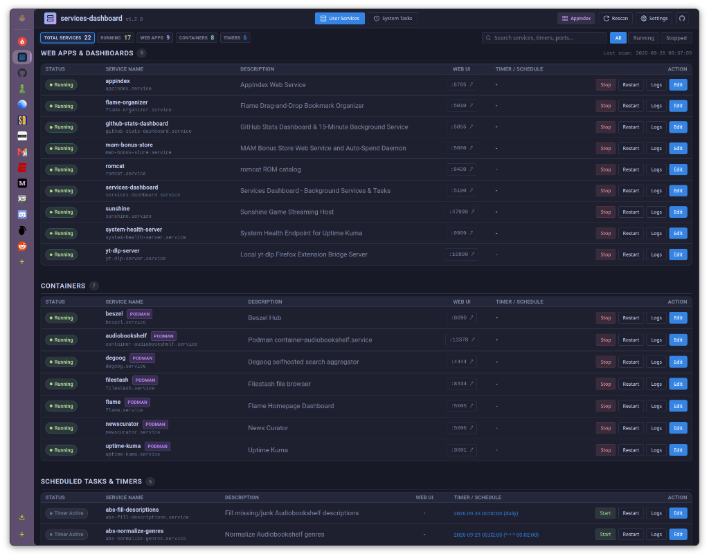
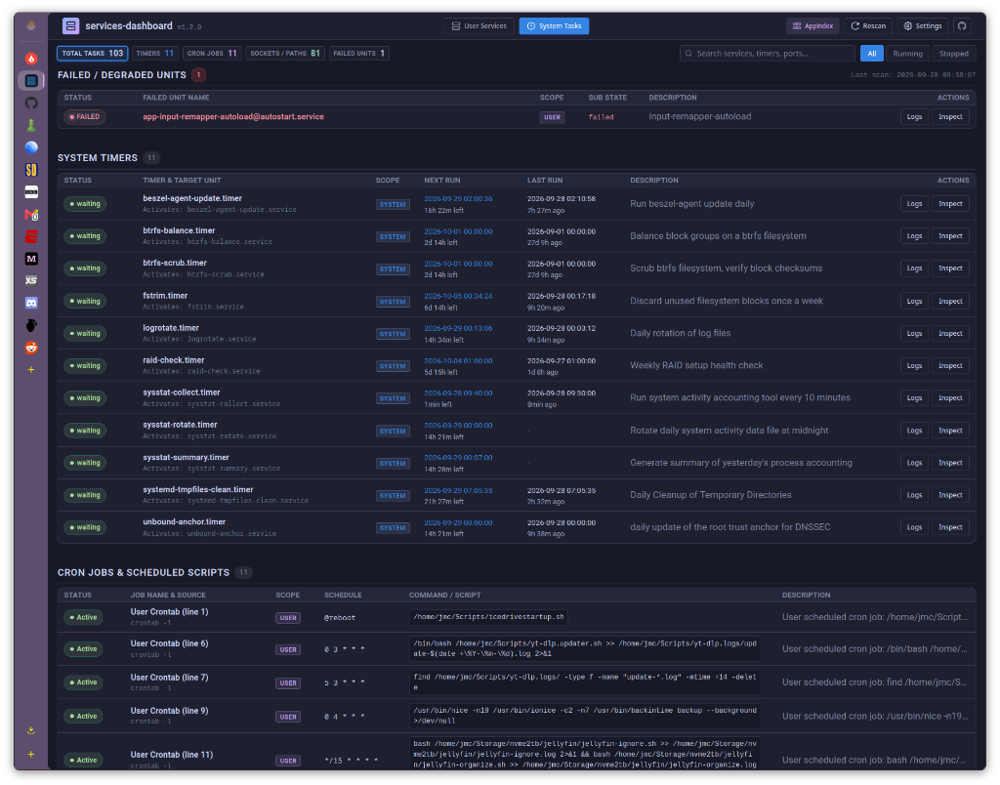

# Services Dashboard

A lightweight, high-performance web dashboard for monitoring, inspecting, and managing rootless Podman Quadlet containers, user-level systemd services, scheduled timers, system maintenance tasks, and cron jobs.

### User Services View


### System Tasks View


## Overview

`Services-dashboard` provides a single pane of glass for Linux user services, rootless containers, and system-level maintenance tasks. Built with FastAPI and vanilla JavaScript, it runs with zero heavyweight frontend build steps, no external dependencies, and minimal memory overhead.

## Key Features

- **Dual-View Navigation**: Seamlessly toggle between **User Services** (containers, user services, web apps) and **System Tasks** (system timers, cron schedules, socket/path watchers) directly from the header navigation.
- **Podman Quadlet & Container Discovery**: Automatically scans and detects rootless Podman containers defined in `~/.config/containers/systemd/` as well as standalone Podman and Docker containers.
- **Systemd User Units & Timers**: Discovers and monitors background user services (`~/.config/systemd/user/`) and associated `.timer` schedules with next-trigger countdowns and last-run timestamps.
- **System-Wide Maintenance Timers**: Inspects systemd system timers (such as `fstrim.timer`, `logrotate.timer`, `btrfs-scrub.timer`, `sysstat`, etc.) with next-trigger countdowns and previous execution history.
- **Cron Job Scanner**: Scans user crontab (`crontab -l`) and system cron directories (`/etc/cron.d/`, `/etc/cron.daily/`, etc.), displaying schedules, script paths, and execution commands.
- **Sockets & Path Watchers**: Live visibility into active socket listeners (`*.socket`) and filesystem path monitors (`*.path`) across system and user scopes.
- **Failed Unit Diagnostics**: Real-time alert section surfacing any failed or degraded units across both user and system scopes.
- **Port & Web App Detection**: Inspects container configs and unit files to detect published ports, providing direct launch links for self-hosted web applications.
- **Safe Unit Inspection & Scoped Logs**: Stream recent service logs in real time (`journalctl -u`) and inspect raw unit definitions in-browser (`systemctl cat`) in read-only mode.
- **Service Controls**: Start, stop, and restart user services directly from the browser UI.
- **Built-in Unit File Editor**: Safely view and edit user `.service` and `.container` unit files in-browser with automatic backup creation (`.bak`) before saving.
- **Instant Search & Quick Filters**: Search by service name, description, command, or port; filter by status (All, Running, Stopped) or category.
- **Theme Customization**: Includes multiple modern dark and light color themes, plus a built-in theme builder with real-time preview and browser persistence.
- **Zero-Terminal Self-Updater**: In-app one-click self-updater supporting both Git and standalone installations with automatic server restart.

## Requirements

- Linux with `systemd` (user session)
- Python 3.10+
- Podman (optional, for Quadlet container discovery)

Python dependencies:
```bash
pip install -r requirements.txt
```

## Quick Start

### 1. Clone and Install

```bash
git clone https://github.com/PlasmaDrifter/Services-dashboard.git
cd Services-dashboard
pip install -r requirements.txt
```

### 2. Run the Dashboard

```bash
python3 app.py
```

The web interface will be available at:
`http://localhost:5100`

### 3. Run as a Systemd User Service

To run automatically in the background on system boot:

1. Copy the unit file to your user systemd directory:
   ```bash
   mkdir -p ~/.config/systemd/user/
   cp services-dashboard.service ~/.config/systemd/user/
   ```

2. Adjust the `WorkingDirectory` and `ExecStart` paths in `~/.config/systemd/user/services-dashboard.service` if your installation path differs (the unit uses `%h` to resolve your home directory automatically).

3. Reload and enable the service:
   ```bash
   systemctl --user daemon-reload
   systemctl --user enable --now services-dashboard.service
   ```

4. Check the service status:
   ```bash
   systemctl --user status services-dashboard.service
   ```

## Configuration & Architecture

- **Backend**: FastAPI with Uvicorn, querying `systemctl --user` and reading unit files directly.
- **Frontend**: Single-page application using modern CSS custom properties and native DOM manipulation.
- **Port Mapping**: Discovers ports via `PublishPort=` in Quadlets or regex matching in Exec directives, supplemented by known port defaults in `scanner.py`.

## License

MIT License.

---

## Community & Discussions

Got questions, setup ideas, or feedback?

* Join our subreddit at [**r/PlasmaDrifterProjects**](https://reddit.com/r/PlasmaDrifterProjects) to discuss updates, get support, and share configurations.
* Contact directly via email at [**plasmadrifter121@gmail.com**](mailto:plasmadrifter121@gmail.com).
